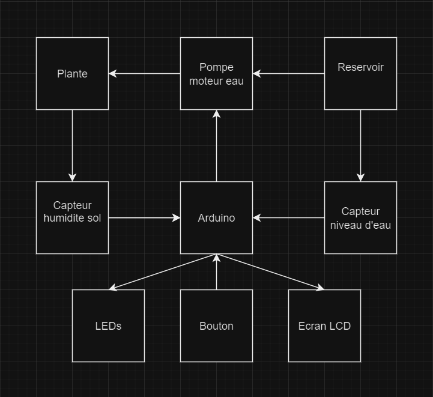

# Serre Autonome

`Author` : `Tachet Mickael` 

## Description
Le but de la serre autonome et de fournir un millieu propice au développement des plantes sans intervention humaine (lumière + eau) 
## Motivation
J'aime beaucoup mes plantes mais malheuresement je les laisse mourir, donc je voudrais leur offrir une meiileur vie et donc un millieu propice ou elles pourrons vivre
## Architecture
--
 Le capteur d'humidité mesure le niveau d'humidité du sol. Si le sol est trop sec, il envoie un signal à l'Arduino.
 En réponse au signal du capteur, l'Arduino active la pompe d'eau qui arrose les plantes jusqu'à ce que le niveau d'humidité adéquat soit atteint.L'écran LCD affiche en temps réel les données sur l'humidité du sol et l'état de la pompe, permettant de vérifier facilement le fonctionnement du système.
### Block diagram

<!-- Make sure the path to the picture is correct -->


### Schematic


### Components


<!-- This is just an example, fill in with your actual components -->

| Device | Usage | Price |
|--------|--------|-------|
| Arduino (kit)| Le microcontrolleur | [73 RON](https://www.emag.ro/kit-plusivo-microcontroller-starter-programabil-in-arduino-ide-x001fpqyl1/pd/DKJN9VMBM/)|
| Capteur humidite sol | Mesure l'humidite du sol | [10 RON](https://www.optimusdigital.ro/ro/senzori-senzori-de-umiditate/73-senzor-de-umiditate-a-solului.html?search_query=umiditate+sol&results=26)|
| Pompe d'eau | Pompe d'eau submersible qui pompe de l'eau | [10 RON](https://www.optimusdigital.ro/ro/altele/4149-mini-pompa-de-apa-submersibila.html)|
| Capteur nv d'eau | sert a voir combien d'eau il ns reste | [2 RON](https://www.optimusdigital.ro/ro/senzori-altele/272-senzor-de-nivel-al-apei.html?search_query=senzor+apa&results=199)
| Ecran LCD | Affiche les informations utiles| [17 RON](https://www.optimusdigital.ro/ro/optoelectronice-lcd-uri/2894-lcd-cu-interfata-i2c-si-backlight-albastru.html)|
|Led| fais de la lumiere | [dans le kit](https://www.emag.ro/kit-plusivo-microcontroller-starter-programabil-in-arduino-ide-x001fpqyl1/pd/DKJN9VMBM/) |
|Le tuyau| Un tuyau est un tube ou un conduit fabriqué à partir de divers matériaux comme le métal, le plastique, le caoutchouc ou d'autres substances, utilisé pour transporter des liquides, des gaz ou des matières solides sous forme de poudre ou de granules. Les tuyaux sont utilisés dans une variété d'applications, y compris dans les systèmes de plomberie, de chauffage, de climatisation, d'irrigation, de transport de pétrole et de gaz, ainsi que dans les installations industrielles et chimiques. | [7 RON](https://www.optimusdigital.ro/ro/altele/7106-mini-furtun-flexibil-6x8-mm-1-m.html?search_query=Furtun&results=3)
### Libraries

<!-- This is just an example, fill in the table with your actual components -->

| Library | Description | Usage |
|---------|-------------|-------|
| [pour le lcd](https://github.com/blackhack/LCD_I2C) | Arduino library to control a 16x2 LCD via an I2C adapter based on PCF8574 | permet d'utiliser l'ecran  |

### Code
[->  <-](src/automated_greenhouse.ino)
## Log
https://github.com/UPB-FILS-AM-FR/am-projet-MkI21/assets/119680825/c072ad3d-2c72-423a-834b-5d5ba84f096a
<!-- write every week your progress here -->

### Week 6 - 12 May
nu prea am fct cv
### Week 7 - 19 May
aici am dat comanda de piese
### Week 20 - 26 May
```
am scris codul si am comandat si furtunul =))) sper ca imi vine pana la prezentare
pe scurt o venit furtunul, totul e bun mai putin cand pun motorul in circuit care nu are destula putere , apare o scadere de tensiune si toti pinii (digitali, 3v3, 5v) provides only 1,10 V deci mna, am incercat cu un NPN si un rezistor cu o baterie separata dar mna tot nu merge 
```
## Reference links

<!-- Fill in with appropriate links and link titles -->
[Article capteur sol](https://lastminuteengineers.com/soil-moisture-sensor-arduino-tutorial/)

[article capteur eau](https://lastminuteengineers.com/water-level-sensor-arduino-tutorial/)

[map a l'envers](https://forum.arduino.cc/t/map-reverse-ranges/504133)

[npn](https://www.onsemi.com/pdf/datasheet/p2n2222a-d.pdf)
